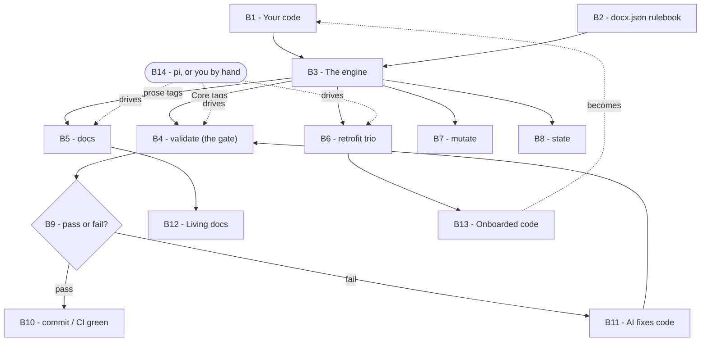

# docx-pi — a slop-catcher for AI-written code

**In one sentence:** this is a small tool that watches the code your AI assistant writes and stops it from quietly making a mess — bloated functions, sneaky new dependencies, fake tests — while also writing your project's documentation for you.

It plugs into [pi](https://pi.dev/) (a coding assistant you run in your terminal), but the core is just a command you can run by hand.

---

## Read this first (the whole idea in 2 minutes)

When you "vibe code" — describe what you want and let an AI write it — you get working code fast. But the AI has a habit: to make something *run*, it will happily write a 90-line function, pull in three random libraries you've never heard of, and write a "test" that doesn't actually test anything. Each of those is fine once. Over a few weeks they pile up into a codebase you can't understand or trust. People call this **slop**.

The catch is that *you*, the vibe coder, often can't see it happening — you're reading the output, not auditing it.

`docx-pi` is like a **seatbelt** for that. It doesn't slow you down when things are fine. But the moment the AI tries to do something sloppy, it clicks tight and says "no." You never have to remember the rules — the AI does the work, and this tool checks it.

Here's the trick that makes it possible. Instead of keeping your rules in some document nobody reads, DocX writes them as tiny **notes inside the code itself**, right next to what they describe. Like this:

```python
# @docslim: max_lines = 20          <- "this function may not exceed 20 lines"
# @docdeps: allowed_imports = ["math"]   <- "this file may only import 'math'"
def calculate_total(a_items):
    ...
```

Those `# @doc...` lines are comments — they don't change how the code runs. But `docx-pi` reads them and enforces them. Because the rule lives *next to* the code, it can't get lost, and when the AI edits the code next week, it sees the rule sitting right there.

That's the entire philosophy: **the rules travel with the code.**

---

## What counts as "slop," and how each guardrail stops it

There are four guardrails that actually block a commit, plus one that keeps tests honest. Here's each one in plain terms.

**1. Functions that balloon → `docslim`.**
Think of it as a **word limit on an essay**. You tell it "no function longer than 20 lines, no deeper than 3 levels of nesting." If the AI writes a tangled 60-line monster, the tool rejects it and the AI has to break it up. Two of the three limits (nesting depth and "complexity" — a standard measure of how many twists and turns a function has) come from decades-old software research; they're not made up.

**2. Random new dependencies → `docdeps`.**
This is a **bouncer with a guest list**. You list the libraries your project is allowed to use. If the AI tries to `import some-random-package`, the bouncer stops it at the door. This is the sleeper hero for keeping a deliberately simple project *simple* — it's exactly how clean stacks slowly rot, one "oh I'll just add this library" at a time.

**3. Hidden side-effects → `docpure`.**
Some functions should be **pure calculators**: same input, same output, no surprises — no printing, no network calls, no reaching out and changing things elsewhere. Tag a function "pure" and this guard flags it if you slip. **Honest scope:** it catches the *obvious* leaks — `print`/`open`/known network calls and `global` writes — but it can't detect every hidden side-effect (e.g. mutating an object you were handed). Treat it as a strong nudge, not a mathematical proof of purity. (Not every function is pure; you only tag the ones that should be.)

**4. Confusing variable shapes → `doctype`.**
This one's a gentle labeling habit. **Every variable name — parameters *and* the locals you declare inside a function** — starts with a one-letter hint about its *shape*: `s_` for a single value (a "scalar" like a number or word), `b_` for a true/false boolean, `a_` for a list, `d_` for a dictionary/map, and a few others (`p_` for a pointer, in Go/Rust/C-family). So `a_items` is obviously a list, `b_is_ready` is obviously a flag. It's a cheap way for both you and the AI to know at a glance what a variable holds — without the heavy machinery of a full type system. In a typed language, the tool also checks the prefix *agrees* with the real type it recognizes (so `a_ctx: dict` is flagged); unusual or exotic types it can't map are left unchecked rather than guessed. The full one-letter list lives in [`skills/docx/references/token-reference.md`](skills/docx/references/token-reference.md), the single official list. In **Perl**, the native `$`/`@`/`%` sigils are used instead, since there they're valid syntax.

**5. Fake tests → `doctest` + the mutation gate.**
The nastiest AI trick: writing a test that *looks* like it checks the code but actually can't fail. `docx-pi mutate` catches this by **sabotage**. It secretly flips a `+` to a `-` in your code and re-runs your tests. If the tests *still pass* after the sabotage, they were never really checking anything — and it tells you so. A real test would have screamed.

There are ~25 more optional tags (for architecture, security, ops notes, etc.), but those are **documentation**, not gates — see "Living docs" below. The five above are the ones that actually stop slop.

---

## How it all fits together

Read the picture top-to-bottom. Every box has an ID (**B1**, **B2**, …); the plain-English key underneath explains each one, and the rest of this README points back to those IDs (e.g. "the gate (**B4**)") so you can always find where a piece sits.



*(Each box is intentionally short — the full explanation is in the key below.)*

**What each box means (the key):**

- **B1 · Your code** — You (or the AI) write normal code, with two habits: every variable name starts with a one-letter *shape* hint (`s_` a number/word, `b_` true-or-false, `a_` a list, `d_` a map, …), and you drop short `@doc…` notes as comments right where they apply.
- **B2 · docx.json** — One small settings file at your project root. It sets how big functions may get, which libraries are allowed, whether you're in low-ceremony **vibe** mode, and which folders to look at.
- **B3 · The engine** — The actual program. It reads each file with tree-sitter (a code-reading library) using a small per-language *adapter*, and checks it against your `docx.json`. No internet needed.
- **B4 · validate — the gate** — Checks your code against the **Core** tags and *fails the build* if a function is too big, pulls a banned import, isn't pure, or has a mislabeled variable. Run it by hand, as a git pre-commit hook, or in CI; add `--changed` to check only the files you edited.
- **B5 · docs** — Reads the **prose** tags scattered in your code and assembles them into one Markdown guide (with an architecture diagram and more) that's rebuilt from the code, so it never goes stale.
- **B6 · retrofit trio** — For onboarding an old, untagged project: `inventory` lists what's there, `suggest-prefixes` proposes the variable renames, `apply` inserts the tags safely.
- **B7 · mutate** — Catches fake tests: it secretly breaks your code and re-runs your tests; if they still pass, the test wasn't really testing. (Python for now; needs `--trust` because it runs your tests as code.)
- **B8 · state** — A quick tag-by-tag checklist of what a file satisfies. Used to drive step-by-step AI builds.
- **B9 · pass or fail** — validate's verdict, as an exit code (0 = clean, 1 = slop).
- **B10 · green** — Clean code → your commit or CI passes.
- **B11 · AI fixes** — A violation → you tell the AI "fix the docx errors" and it does, then validate runs again. That loop is the whole workflow.
- **B12 · Living docs** — The Markdown guide + auto-generated architecture/sequence diagrams that **B5** produces.
- **B13 · Onboarded code** — After the retrofit trio, your old code now carries tags and is guarded — and flows back into **B1** as your normal working code.
- **B14 · pi (or by hand)** — All of this can be driven by your AI assistant through the `/skill:docx` skill and the `/docx-*` slash commands — or you can just run the commands yourself in a terminal.

The two kinds of tag are the key split: **Core** tags feed **B4** (the gate); **prose** tags feed **B5** (the docs). The full list of both is in ["All the DocX tags"](#all-the-docx-tags--what-each-means-and-what-reads-it) below.

## Getting started (three steps)

**Step 1 — install it.**

```bash
cd docx-pi
npm install          # downloads what it needs and builds itself
```

**Step 2 — drop in a rulebook (B2).** Copy the ready-made, heavily-commented config to your project and rename it to `docx.json`:

```bash
cp schema/docx.vibe.jsonc  /path/to/your/project/docx.json
```

That file (open it — it's written to be read) sets sensible default limits and turns on "vibe mode" (explained below). You never write it from scratch; if you use pi, the `/docx-init` command will even fill it in for you by asking a couple of yes/no questions.

**Step 3 — let the AI code, and check its work (B1 → B4).**

```bash
docx-pi path/to/file.py       # "is this file clean?"  exit 0 = yes, 1 = no
```

If it says a function is too long or an import isn't allowed, you tell the AI "fix the docx errors" and it does. That's the loop.

---

## The commands, in plain English

You run these as `docx-pi <command>` (or `node dist/cli.js <command>` before it's installed globally). The **(Bn)** tags map each command to a box in the diagram above.

- **`docx-pi somefile.js`** *(B4 — the gate)* — the main one. Checks a file against its rules. Says PASS or lists exactly what's wrong and on which line. Exit code 1 if anything's wrong, so it fits into automated checks.
- **`docx-pi docs .`** *(B5 → B12)* — writes your documentation *for* you. It reads all the architecture/ops notes scattered in your code and assembles them into one Markdown file with a diagram. Always up to date, because it's rebuilt from the code every time.
- **`docx-pi inventory .`** *(B6, step 1)* — takes a factual census of your existing code (every function, its size, its imports) and dumps it as JSON. Used when onboarding an old project.
- **`docx-pi suggest-prefixes .`** *(B6, step 2)* — scans your project and proposes the `s_`/`a_`/`d_`… rename for every un-prefixed variable (parameters *and* locals), as JSON, so the AI can apply them. It figures out the right prefix from each variable's type.
- **`docx-pi apply file.js blueprint.json`** *(B6, step 3)* — safely inserts tags into a file for you (correct indentation, never touches the actual logic). The safe way to bulk-annotate.
- **`docx-pi state file.py`** *(B8)* — reports, as a simple checklist, which rules a file currently satisfies. Used to drive step-by-step AI builds.
- **`docx-pi mutate file.py`** *(B7)* — the fake-test detector (Python; needs `--trust` because it runs your tests as code).
- **`docx-pi --changed`** *(B4, scoped)* — check only the files you've changed (vs. your last commit, or `--base main`), instead of the whole repo. This is how you apply DocX to *your* edits without touching an upstream package. (More in "Applying it to just your code" below.)
- **`docx-pi help`** — lists every command.

---

## Applying it to just your code (not the whole upstream) — B2 scope + B4 --changed

When you build on top of a package that keeps updating (say you extend PocketBase, or fork something), you don't want DocX demanding that the *entire* upstream codebase be tagged. Two ways to scope it to your subtree:

- **In `docx.json`:** add `include`/`exclude` globs, e.g. `"include": ["pb_hooks/**"]`, `"exclude": ["vendor/**"]`. The docs and inventory tools then only look at your files. Upstream is invisible; when it updates, nothing in your DocX setup cares.
- **Per change:** `docx-pi --changed` gates only the files in your current diff. Your `pre-commit` hook already works this way (it only checks staged files). So "check my extension, ignore the 10,000 upstream files" is automatic.

---

## All the DocX tags — what each means, and what reads it

DocX is really *these tags*. There are two groups: **Core** (the machine-checkable guardrails that can fail your build) and **Extended** (notes that become documentation but never block you). Below is the plain-English version; the terse, precise catalog with syntax examples is `skills/docx/references/token-reference.md`.

**Core tags — enforced by `docx-pi <file>` (the gate, B4):**

| Tag | What it means, plainly | Read by |
|---|---|---|
| `doctype` | Every variable *and* parameter starts with a shape prefix (`s_` scalar, `b_` bool, `a_` list, `d_` dict, `m_` regex match, `f_` function, `o_` object, `p_` pointer). In typed languages the prefix must match the real type. | **validate** (params + locals), `state`, `suggest-prefixes` proposes the renames |
| `docslim` | Caps on a function's size — max lines, nesting depth, and branch complexity. Stops sprawl. | **validate**, `state` |
| `docdeps` | An allow-list of imports/assets. Anything not on it (incl. HTML `<script>`/CSS `@import`) is rejected. | **validate**, `state` |
| `docpure` | A function tagged pure may not do I/O. (Catches *obvious* I/O — print/open/network; see limits below.) | **validate**, `state` |
| `doctest` | An executable example in the docstring — doubles as a test. | **mutate** (runs & sabotages it, Python), `state` |
| `docinv` | A class invariant — a condition that must always stay true. | `state`, **docs** |
| `docref` | Inherit shared settings from `docx.json` instead of repeating them. | **validate** (resolves the cascade), `state` |

**Extended tags — assembled into your docs by `docx-pi docs` (B5, never block a build):**

| Tag | What it means, plainly | Read by |
|---|---|---|
| `docarch` | A component, its layer, and what it relies on — builds the architecture diagram. | docs (Architecture + diagram) |
| `docbiz` | The business reason this exists. | docs (Business & Intent) |
| `docspec` | Acceptance behavior — given / when / then. | docs (Business & Intent) |
| `docrisk` | A threat or trust-boundary note (e.g. STRIDE). | docs (Security) |
| `doccomp` | Maps this code to a regulation (GDPR, PCI, SOX…). | docs (Security) |
| `docperm` | Who's allowed — roles, auth scheme. | docs (Security) |
| `doctaint` | Untrusted-data flow: source → sanitizer → sink. | docs (Security) |
| `docpriv` | Marks PII and how it's masked. | docs (Security) |
| `docstring` | A plain description of an interface. | docs (Interfaces) |
| `docsub` | Declares a subtype relationship (Liskov). | docs (Subtyping) |
| `doctrace` | A runtime hop, e.g. `[BRIDGE: API -> Ledger]`. | docs → **sequence diagram** |
| `docfail` | Failure handling — fallback, alert target. | docs (Operations) |
| `docrun` | The 3 a.m. runbook — what to do when it breaks. | docs (Operations) |
| `docmet` | Runtime performance budget (latency, memory). | docs (Operations) |
| `docenv` | Required runtime — OS, language version. | docs (Configuration) |
| `doccfg` | Configuration values / IaC settings. | docs (Configuration) |
| `docdev` | How to bootstrap the project locally. | docs (Developer Setup) |
| `docmock` | Test fixtures and mock data. | docs (Test Fixtures) |
| `docchg` | Change log — deprecations, migration paths. | docs (Change Log) |
| `docdata` | Data lineage — where data comes from and goes. | docs (Data & Interface) |
| `docux` | UI contract — component → layout / WCAG. | docs (Data & Interface) |
| `doccost` | Cloud cost budget per workload. | docs (Cost Budgets) |
| `docrule` | A *documented local exception* to a rule. In strict mode it can downgrade a named rule to a warning; **in vibe mode it's ignored** (an agent can't unlock its own cage). | **validate** + docs (Policy Exceptions) |

`apply` inserts *any* tag; `inventory` and `suggest-prefixes` read your *code* (not tags) to feed the Core checks.

---

## "Vibe profile" — the mode built for you (a setting in B2)

There are two ways to run: **strict** (for teams with a reviewer) and **vibe** (for a solo hobbyist where the AI writes and maintains everything). The config you copied in Step 2 already turns on vibe mode. Two things make it right for vibe coding:

1. **Only the five real guardrails are enforced.** The two dozen documentation tags are never allowed to block you — they're just notes.
2. **The limits live in *your* config file, not in the code.** This matters more than it sounds. If the AI could write its *own* line limit into each function, it would just set it to "999" whenever its code was too long — cheating past the guard. So in vibe mode, the limits come only from your `docx.json`, and any limit the AI tries to set on a specific function is ignored (with a note). The guard stays in *your* hands.

There's a live example: `examples/vibe/overreach.py` is a function that tries to grant itself a 999-line budget. In vibe mode it fails (your config's real limit wins); in strict mode it's allowed. Same file, two behaviors — proof the guard works.

---

## Living docs (the nice surprise) — B5 → B12

Nobody writes documentation, and the docs you do write go stale in a week. DocX flips this: you (or the AI) sprinkle little notes in the code — `# @docarch: component = "Login", relies_on = ["AuthService"]` — and then:

```bash
docx-pi docs .
```

...assembles them all into a single guide with an **architecture diagram**, security notes, an ops "what to do at 3am" runbook, and a changelog — every entry linked back to the exact file and line. Because it's regenerated from the code, it's never out of date. Open `examples/DOCX-DOCS.sample.md` to see a real one this repo produced from its own examples. This is also a sneaky way to *learn* architecture: you read the diagram of your own project and the concepts click.

---

## Honest limits (what it does NOT do)

I'd rather tell you the gaps than let you discover them.

- **HTML and CSS are checked, but at a lighter level than code.** Vanilla HTML/CSS *is* covered now: `docdeps` guards external `<script>`, `<link>` stylesheets, fonts, ``, `@import`, and `url()` assets against your allow-list; a couple of smells warn about inline `<script>`/`<style>` blobs and heavy `!important`; and their comments feed the docs. What's **not** covered is framework logic *inside* attributes — Alpine's `x-data="..."`/`@click="..."` is treated as opaque, by design. The rule of thumb (and just good practice): keep templates thin and put real logic in `.js`/hook files, where it's fully guarded.
- **Perl's support is complete but needs a one-time build.** The Perl adapter uses the *real* grammar's node names (pulled from `tree-sitter-perl`'s own definitions), so it's accurate — but Perl ships without a prebuilt parser binary, and this environment had no toolchain to build one (see `scripts/build-perl-grammar.md`). Everything else (Python, JavaScript, TypeScript, Go, Rust, Ruby, PHP) works out of the box.
- **The mutation ("fake test") detector is Python-only for now.** Other languages don't have a built-in test format it can hook into yet.
- **Variable renaming is the AI's job.** `suggest-prefixes` proposes the renames, but applying them (renaming a variable *and its uses*) is done by the AI and then verified by the validator — the tool doesn't auto-rewrite your code across scopes.
- **The documentation tags can drift; only the guardrails self-heal.** The Core tags (`docslim`/`docdeps`/`doctype`/`docpure`) are re-checked against the code on every run, so they can't quietly go wrong. But the prose tags (`docarch`, `docrisk`, `docrun`, …) are *notes* — nothing verifies they still match the code after you edit it. A stale architecture note is worse than none, because the next reader trusts it. So when you (or the AI) change tagged code, refresh its prose tags too, and regenerate `docx-pi docs`. The `docx` skill instructs the agent to do exactly this.
- **It's not magic.** It catches *structural* slop (size, dependencies, purity, hollow tests). It can't tell you your idea is bad or your logic is subtly wrong. It's a seatbelt, not a chauffeur.

---

## Every file in this package, explained

Here's the whole box, drawer by drawer.

### The rulebooks you actually touch (`schema/`)
- **`schema/docx.vibe.jsonc`** — **start here.** The friendly, fully-commented config. Copy it to your project as `docx.json`. Reads like a short tutorial. (It's JSONC — the loader strips the comments, so it works as-is.)
- **`schema/docx.schema.json`** — a formal definition of what a valid `docx.json` may contain (used by editors to autocomplete and warn). You don't edit this.

### How to talk to it through pi (`skills/` and `prompts/`)
- **`skills/docx/SKILL.md`** — the instruction sheet the AI reads so it knows the DocX rules and habits. This is what makes the assistant "speak DocX."
- **`skills/docx/references/token-reference.md`** — **the single official list** of every tag, the variable-shape prefixes, and how to pick your size limits. The one place these are defined.
- **`skills/docx/references/docx-spec.md`** — the deeper "why it's designed this way" document. Concepts, not a rule list.
- **`skills/docx/references/orchestration.md`** — explains the optional "build a service step by step, checking rules at each stage" workflow.
- **`prompts/docx-init.md`** — the `/docx-init` command: sets up DocX in your project by asking you a couple of easy questions.
- **`prompts/docx-validate.md`** — the `/docx-validate` command: check files and explain any problems in plain language.
- **`prompts/docx-annotate.md`** — the `/docx-annotate` command: add the right tags to a file, or draft a fresh "contract" for new work.
- **`prompts/docx-retrofit.md`** — the `/docx-retrofit` command: take an existing untagged project and add DocX to it, safely, in three passes.
- **`prompts/docx-docs.md`** — the `/docx-docs` command: generate the living documentation.
- **`prompts/docx-orchestrate.md`** — the `/docx-orchestrate` command: build something new phase-by-phase with rule checks at each gate.

### The actual program (`src/` — TypeScript source)
You never need to open these, but here's what each does.
- **`src/cli.ts`** — the front door. Reads your command (`validate`, `docs`, `mutate`, …) and calls the right part.
- **`src/validate.ts`** — the heart. Runs the five guardrails on a file and collects the violations.
- **`src/html.ts`** — the HTML checker: guards external `<script>`/`<link>`/`` assets and warns about inline `<script>`/`<style>` blobs.
- **`src/css.ts`** — the CSS checker: guards external `@import`/`url()` assets and warns about heavy `!important`.
- **`src/inventory.ts`** — the "census taker": lists every function, param, import, and size in a project as JSON (retrofit Pass 1).
- **`src/suggest.ts`** — proposes the `s_`/`a_`/`d_`… rename for each un-prefixed variable, so the AI can apply them.
- **`src/apply.ts`** — the "safe stapler": inserts tag comments into files without disturbing the code (retrofit Pass 3).
- **`src/state.ts`** — produces the rule-by-rule checklist (the `token_state_matrix`) for a file.
- **`src/mutate.ts`** — the fake-test saboteur (flips operators, re-runs tests, reports hollow ones).
- **`src/scope.ts`** — the "only my subtree" logic (honors `include`/`exclude` globs so upstream code is ignored) *and* the one shared directory-walker that `inventory`, `docs`, and `suggest-prefixes` all use.
- **`src/extension.ts`** — the glue that lets pi call all this as a built-in tool and slash-commands.
- **`src/docs/generate.ts`** — reads all the doc notes and builds the Markdown guide + diagram.
- **`src/core/tags.ts`** — knows how to find and read `@doc...` notes in text.
- **`src/core/cascade.ts`** — reads your `docx.json` and works out which rules apply to a given file (including comment-tolerant config parsing).
- **`src/core/report.ts`** — formats the results you see on screen.
- **`src/core/types.ts`** — the shared vocabulary (definitions) the other files agree on.
- **`src/engine/parser.ts`** — starts up tree-sitter (the code-reading engine) and loads the right language grammar.
- **`src/engine/metrics.ts`** — the generic measuring tape: counts lines, nesting, complexity, imports — the same way for every language.
- **`src/adapters/`** — one small file per language (`python.ts`, `javascript.ts`, `typescript.ts`, `go.ts`, `rust.ts`, `ruby.ts`, `php.ts`, `perl.ts`) telling the engine what "a function" or "an import" looks like *in that language*. `index.ts` picks the right one by file extension. Adding a new language = one new file here.

### Ready-made examples (`examples/`)
Every language has a `billing.*` (clean, passes) and a `bad.*` (deliberately sloppy, gets caught) pair, each with its own `docx.json`. Plus:
- **`examples/vibe/overreach.py`** — the "AI tries to cheat its own limit" demo.
- **`examples/mutate/solid.py` / `hollow.py`** — a real test vs. a fake test, for the mutation detector.
- **`examples/html/` and `examples/css/`** — the HTML and CSS dependency/smell checks (good vs. bad pairs); **`examples/frontend/`** — a frontend-plus-hook architecture example.
- **`examples/DOCX-DOCS.sample.md`** — a real auto-generated documentation file, so you can see the output.

### Plumbing (you rarely touch)
- **`hooks/pre-commit`** — drop this into git and it checks your files automatically every time you commit; blocks the commit if something's sloppy.
- **`ci/docx.yml`** — the same check for GitHub, so pull requests get checked automatically.
- **`scripts/setup-grammars.js`** — reports which languages are ready to go.
- **`scripts/build-perl-grammar.md`** — the one-time instructions to enable Perl.
- **`package.json`**, **`tsconfig.json`**, **`.gitignore`**, **`.npmignore`** — standard project config (dependencies, build settings). Auto-managed.
- **`dist/`** — the compiled, ready-to-run version of `src/`. **Not shipped in source** — it's created by `npm install` (which runs the build automatically). Don't edit it by hand.

---

## A tiny glossary of scary words

- **tree-sitter** — a library that reads source code and understands its structure (where functions and imports are), the way a grammar-checker understands sentences. It's how we measure code accurately instead of with fragile text-matching.
- **WASM (WebAssembly)** — a portable format that lets tree-sitter's language packs run anywhere without you installing a compiler. That's why this "just works" cross-platform and offline.
- **token / tag** — one of the `@doc...` notes (like `@docslim`).
- **adapter** — the small per-language file that teaches the engine one language's shapes.
- **cascade** — the way rules flow down: set a default in `docx.json`, optionally override it for a folder. Like CSS for rules.

---

## Where to go next

- Just want the guardrails? Copy `schema/docx.vibe.jsonc` → `docx.json`, run `docx-pi <file>`, done.
- Using pi? `pi install -l ./docx-pi`, then `/docx-init` to set up and `/skill:docx` to teach the assistant.
- Curious how it thinks? Read `skills/docx/references/token-reference.md` (the rules) and `docx-spec.md` (the why).

One version note for the technically curious: the code-reading engine is pinned to `web-tree-sitter` version **0.25.0** on purpose — a newer version changed an internal format and won't load the bundled language packs. If you ever bump it, bump the language packs to match.
