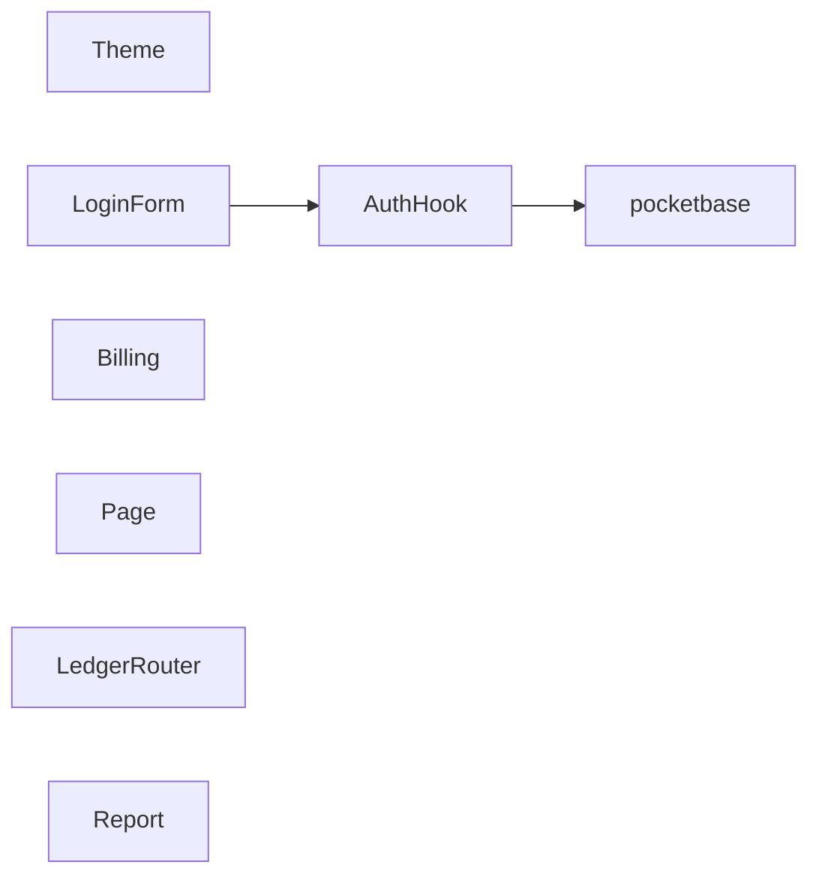
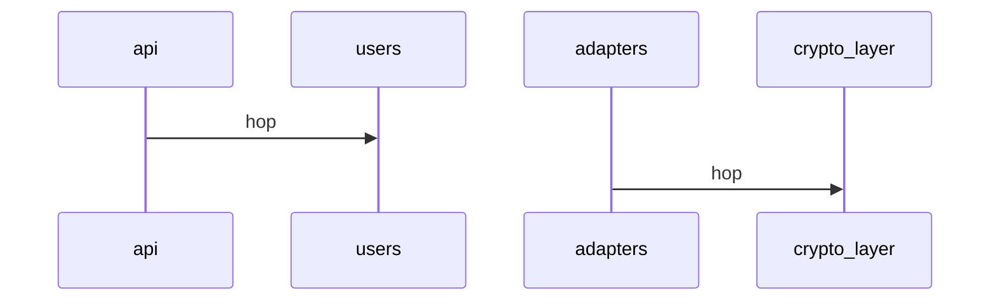

# Project Documentation

> Generated by `docx-pi docs` on 2026-08-06 from DocX annotations. Do not edit by hand — re-run the generator. 76 annotation(s) across the codebase.

## Architecture

### Components

- **Theme** — `css/good.css:1`
- **AuthHook** — **layer**: hooks, **relies_on**: pocketbase — `frontend/auth_hook.js:1`
- **LoginForm** — **layer**: frontend, **relies_on**: AuthHook — `frontend/index.html:2`
- **Billing** — `go/billing.go:3`
- **Page** — **layer**: frontend — `html/good.html:2`
- **Billing** — `js/billing.js:1`
- **Billing** — **layer**: core — `perl/invoice.pl:2`
- **LedgerRouter** — **layer**: adapters — `python/ledger_router.py:2`
- **Billing** — `ts/billing.ts:1`
- **Report** — `vibe/overreach.py:1`

## Business & Intent

- **intent**: Authorize inbound settlement amounts within PCI scope — `python/ledger_router.py:3`

## Security & Compliance

- `docrisk` **boundary**: public /api/login -> users collection, **vector**: STRIDE.Spoofing — `frontend/auth_hook.js:2`
- `doccomp` **standard**: PCI-DSS v4.0, **section**: 3.2.2 — `python/ledger_router.py:4`
- `docperm` **role_required**: ServiceAccount.Billing, **auth**: OAuth2 — `python/ledger_router.py:30`
- `docrisk` **boundary**: External API -> Core Ledger, **vector**: STRIDE.Tampering — `python/ledger_router.py:31`
- `doctaint` **source**: d_secure_context, **status**: Untrusted — `python/ledger_router.py:34`
- `docpriv` **classification**: PII.Financial, **masking**: Full — `python/ledger_router.py:35`

## Operations & Runbooks

- `docrun` **triage**: tail pb logs; check auth rate-limit; restart pocketbase — `frontend/auth_hook.js:3`
- `docenv` **runtime**: perl>=5.36 — `perl/invoice.pl:4`
- `docenv` **platform**: linux/amd64, **runtime**: python>=3.11 — `python/ledger_router.py:6`
- `docfail` **fallback**: Reject_Tx, **alert**: PagerDuty — `python/ledger_router.py:52`
- `docrun` **triage**: run scripts/clear_stuck_db_locks.sh -id <tx> — `python/ledger_router.py:53`

## Data & Interface

- `docux` **component**: LoginForm, **wcag**: AA, **layout**: centered-card — `frontend/index.html:3`

## Interfaces

- **lifecycle**: Active, **stability**: Production — `python/ledger_router.py:23`

## Invariants & Contracts

- `self.s_floor_cents >= 0` — `python/ledger_router.py:24`

## Configuration

- `docenv` **runtime**: perl>=5.36 — `perl/invoice.pl:4`
- `docenv` **platform**: linux/amd64, **runtime**: python>=3.11, **memory_limit_mb**: 128 — `python/ledger_router.py:6`

## Runtime Sequence (from doctrace)

